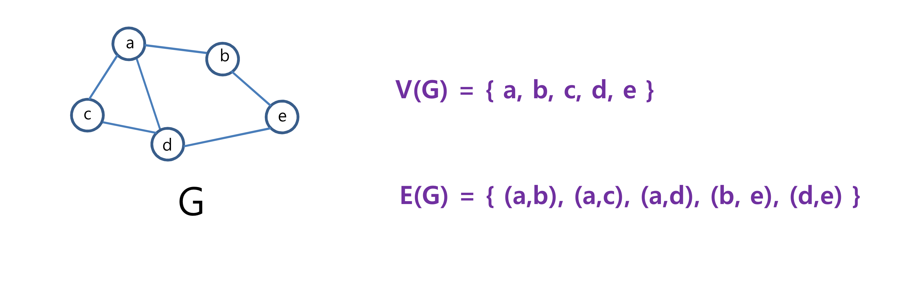

## Graph

### Graph 란?
> vertex(V)의 집합과 edge(E)의 집합으로 이루어짐

### 용어
- **adjacent** : 두 vertex 간의 edge가 존재 (인접함)
- **path** : 두 vertex간에 edge로서 연결되는 vertex의 sequence (간접 연결도 ok)
- **length of a path** : path를 구성하는 edge 개수
- **connected** : 두 vertex간에 path가 존재
- **connected components** : 상호 연결된 subgraph
- **cycle** : 시작과 끝이 동일 vertex인 path (자기 자신에서 출발해 다시 돌아옴)

### edge 표기
- (v1, v2) : 방향성이 없는 edge -> undirected graph
- <v1, v2> : 방향성을 갖는 edge -> directed graph

### 연산
##### DFS (Depth First Search)
- algorithm (stack 사용)
  1) start vertex를 방문하고 stack에 push
  2) stack이 empty일 때까지 다음을 반복
    - stack의 top원소와 adjacent한 vertex 중에 아직 방문하지 않은 vertex를 한 개 선택하여 방문하고 stack에 push. 더이상 선택할 원소가 없다면, stack에서 원소 한 개를 pop

##### BFS (Breadth First Search)
- algorithm (queue 사용)
  1) start vertex를 방문하고 enqueue
  2) queue가 empty일 때까지 다음을 반복
    - queue의 front 원소와 adjacent한 vertex 중에 아직 방문하지 않은 vertex를 선택하여 방문하고, enqueue. 더이상 선택할 원소가 없다면 dequeue
