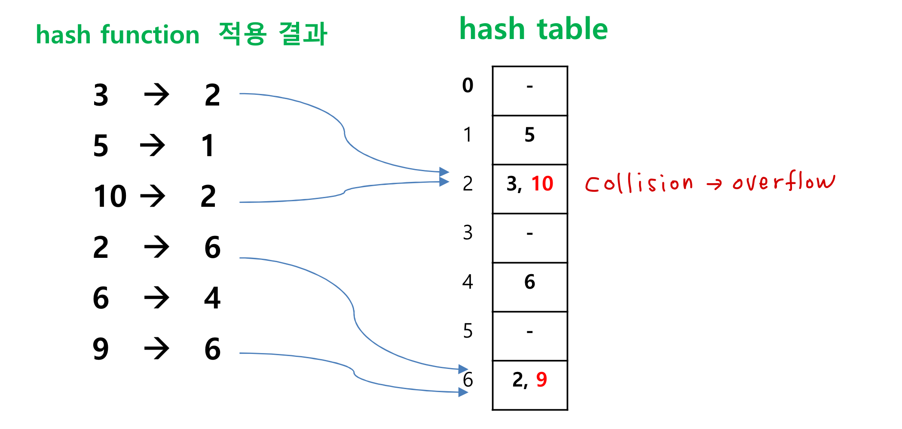

## Hashing

### Hashing 이란?
> key 값에 어떤 연산(hash function)을 적용하여 해당 key 값의 저장된 위치를 찾아내는 방식

### 용어 정리
- **hash table** : 일정 개수의 buckets으로 이루어진 연속적인 공간, key 값을 갖는 원소가 저장되는 공간
- **hash function** : 주어진 key와 hash table 상의 address를 mapping하는 함수
- **collision** : 서로 다른 key 값이 동일 bucket 주소로 mapping
- **overflow** : 어떤 bucket에 slot 수보다 많은 수의 원소가 저장돠려 할 때

### Hashing 예제
**key 값 k의 집합 {3,5,10,2,6,9}에 대하여 다음 hash function을 적용**
> F(k) = (k * 3) % 7

### Hashing 의 구현에 관한 issues
1) Hash function
2) Overflow handling method

#### Hash function 구현
- mid-squre : 주어진 key값(2진수)을 제곱한 결과에서 중간의 일정 수 bit를 선택 -> 가급적 흩어진 정보를 얻을 수 있음
- folding : key 값의 2진수 string을 몇 개의 part로 나누고, 겹쳐서 덧셈
- division : modulus operator (%) 사용
- digit analysis : key 값을 임의의 진수로 변환, 적절한 digit을 선택 (모든 key값의 형태를 사전에 알 수 있는 경우)
